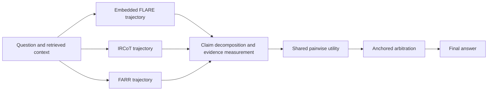

# FARR-EVA Research Artifact

[](https://github.com/gangmurloc/FARR-EVA/actions/workflows/tests.yml)

[한국어 README](README_KR.md)

FARR-EVA is a research prototype for **post-execution arbitration** among
three completed multi-hop QA trajectories: embedded FLARE, IRCoT, and FARR.
It decomposes candidate answers and traces into claims, measures their support
against retrieved evidence with a frozen reranker and NLI model, and applies a
shared pairwise linear utility to select an answer.

This repository is a compact, auditable release extracted from the research
workspace. It intentionally excludes raw datasets, generated candidate pools,
large model checkpoints, experiment logs, and manuscript files.

## Author

**Gangil Lee** — Undergraduate Researcher, NLP Laboratory, Hallym University

Research interests: natural language processing, large language models,
retrieval-augmented generation, and multi-hop question answering.

## My contributions

- Designed the FARR-EVA evidence-vector arbitration framework.
- Implemented candidate evidence measurement and selector training.
- Constructed the HotpotQA, 2WikiMultiHopQA, and MuSiQue evaluation protocol.
- Implemented locked evaluation, paired bootstrap analysis, integrity checks,
  unit tests, and the compact public release.

FLARE and IRCoT are prior methods used here as candidate-generation
strategies. The local implementations are research adaptations rather than
official reproductions. See [Attribution](#attribution) and
[`THIRD_PARTY_NOTICES.md`](THIRD_PARTY_NOTICES.md) for the boundary between
prior work and this project.

## Research question

Can a question-level arbitration layer improve a fixed retrieval-reasoning
expert without using dataset identity, expert identity, gold answers, gold
supporting facts, or runtime counters as inference features?

## Method



The selector receives a 28-dimensional evidence vector for every candidate.
The same feature function and utility are shared across candidates. FARR is the
anchor; the selector switches only when the best alternative clears the frozen
utility threshold.

## Verified Test-C result

The frozen FARR-EVA artifact was evaluated once on a question-disjoint Test-C
containing 6,000 questions (2,000 each from HotpotQA, 2WikiMultiHopQA, and
MuSiQue).

| System | Macro F1 | Macro EM |
|---|---:|---:|
| Fixed FARR anchor | 0.5140 | 0.4125 |
| FARR-EVA | 0.5754 | 0.4608 |

The same locked result by dataset is:

| Dataset | Fixed FARR F1 | FARR-EVA F1 | Delta |
|---|---:|---:|---:|
| HotpotQA | 0.6415 | 0.6618 | +0.0202 |
| 2WikiMultiHopQA | 0.4995 | 0.5904 | +0.0909 |
| MuSiQue | 0.4011 | 0.4741 | +0.0730 |
| **Macro** | **0.5140** | **0.5754** | **+0.0614** |

The paired macro-F1 difference was **+0.0614**, with a 95% dataset-stratified
bootstrap interval of **[0.0529, 0.0700]**.

These numbers establish improvement over the fixed FARR anchor on Test-C; they
do **not** establish that FARR-EVA is the best possible selector. A later
post-hoc diagnostic applied a corrected earlier portable selector to the same
Test-C candidates and obtained 0.5844 macro F1, 0.0090 above FARR-EVA. Because
Test-C had already been inspected, that comparison is diagnostic rather than
confirmatory. A new balanced fresh Test-D (3,000 questions per dataset) was
locked to resolve the selector comparison and is not reported here before it
is completed.

Machine-readable values and interpretation boundaries are in
[`results/test_c_summary.json`](results/test_c_summary.json) and
[`docs/research_status.md`](docs/research_status.md).

## Install

```bash
git clone https://github.com/gangmurloc/FARR-EVA.git
cd FARR-EVA
python -m venv .venv
source .venv/bin/activate
pip install -e .
```

The direct dependency versions recorded with the reported environment are in
[`requirements-snapshot.txt`](requirements-snapshot.txt). They are a reproduction
snapshot, not a promise that every CUDA build is portable across machines.

Candidate generation uses local Hugging Face causal and sequence-classification
models and therefore requires sufficient model storage and, for the reported
configuration, CUDA hardware. Unit tests and the selector demo run without
downloading those models.

## Quick checks

```bash
python -m unittest discover -s tests -v
python examples/selector_demo.py
python scripts/preflight_public_release.py
```

The demo loads the small validation-locked selector artifact and scores a
synthetic three-candidate feature group. It is an API smoke test, not a QA
quality benchmark.

## Reproduce

The smallest runnable reproduction is the frozen-artifact smoke test:

```bash
python examples/selector_demo.py
```

To inspect the full experiment interfaces without downloading models or data:

```bash
python prepare_farr_eva_test_c.py --help
python run_farr_eva_test_c_candidates.py --help
python extract_candidate_evidence_features.py --help
python train_farr_eva_selector.py --help
python analyze_farr_eva_test_c.py --help
```

Full candidate generation requires benchmark records, prepared split
manifests, local model weights, and substantial GPU time. The exact Test-C IDs
and generated candidate rows are intentionally not redistributed; therefore,
the repository does not mislabel the smoke test as an exact end-to-end Test-C
reproduction. The stages and expected inputs are documented in
[`docs/reproducibility.md`](docs/reproducibility.md).

## Reproduction map

| Stage | Entry point |
|---|---|
| Benchmark candidate generation | `run_benchmark.py` |
| Test-C candidate generation | `run_farr_eva_test_c_candidates.py` |
| Evidence-vector extraction | `extract_candidate_evidence_features.py` |
| Pairwise selector training | `train_farr_eva_selector.py` |
| Locked Test-C analysis | `analyze_farr_eva_test_c.py` |

The original datasets are not redistributed. Obtain HotpotQA,
2WikiMultiHopQA, and MuSiQue from their official sources and comply with their
respective licenses. The full candidate pools are also omitted because they
contain generated text and are hundreds of megabytes in size.

## Repository scope

Included:

- retrieval/reasoning expert implementations;
- evidence-vector extraction and arbitration code;
- the small validation-locked linear selector;
- feature and source manifests;
- unit tests and a synthetic demo;
- a compact, provenance-aware result summary.

Excluded:

- raw or prepared datasets;
- generated candidate/evidence rows;
- multi-gigabyte Hugging Face model weights;
- logs, exploratory outputs, and manuscripts;
- the unpublished Test-D question manifest and results.

## Limitations

- All reported main benchmarks are English Wikipedia-style multi-hop QA.
- Arbitration pays the cost of producing all required candidate trajectories.
- The evidence measurements depend on frozen reranker and NLI models.
- Candidate-set failures cannot be fixed by selection alone.
- Test-C does not settle the comparison between FARR-EVA and the corrected
  portable selector; the fresh Test-D was created for that purpose.

## Attribution

This project builds on or evaluates with the following prior work and public
resources:

- [FLARE: Active Retrieval Augmented Generation](https://arxiv.org/abs/2305.06983)
- [IRCoT: Interleaving Retrieval with Chain-of-Thought Reasoning](https://arxiv.org/abs/2212.10509)
- [HotpotQA](https://arxiv.org/abs/1809.09600)
- [2WikiMultiHopQA](https://arxiv.org/abs/2011.01060)
- [MuSiQue](https://aclanthology.org/2022.tacl-1.31/)
- [Qwen2.5-7B-Instruct](https://huggingface.co/Qwen/Qwen2.5-7B-Instruct)
- [BGE reranker v2 m3](https://huggingface.co/BAAI/bge-reranker-v2-m3)
- [DeBERTa NLI model](https://huggingface.co/MoritzLaurer/DeBERTa-v3-base-mnli-fever-anli)

FARR and FARR-EVA are the project-local retrieval/revision and arbitration
components. Model weights and benchmark records are not redistributed here;
users must follow each upstream resource's terms.

## License

No open-source license has been selected yet. Public visibility does not grant
permission to copy, modify, or redistribute the code. The author should choose
a license after verifying compatibility with all included code and model
artifacts. See [`THIRD_PARTY_NOTICES.md`](THIRD_PARTY_NOTICES.md).
